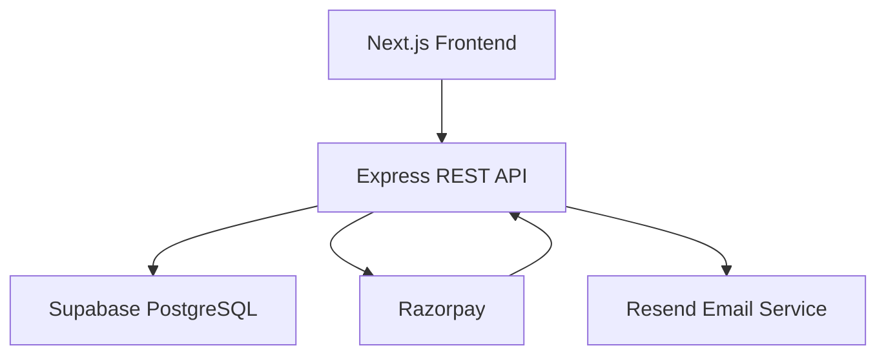

<h1 align="center">PhysioWaye</h1>
<p align="center">
  <strong>Production-Ready Healthcare E-Commerce Platform</strong><br/>
  A production-grade, full-stack e-commerce application with enterprise security, real payment processing, and clean architecture.
</p>

<p align="center">
  <a href="https://www.physiowaye.com" target="_blank">
    
  </a>
  
  
  
</p>

---

## Overview

PhysioWaye is a freelance, client-facing e-commerce platform built for a physiotherapy equipment business. It supports the complete customer journey — product discovery, cart and wishlist management, secure Razorpay checkout, order tracking, and account management — backed by a Node.js/Express REST API, a PostgreSQL database with Row Level Security, and an Admin Dashboard with sales analytics.

The project is built for long-term production use on a cost-minimal infrastructure stack with a custom domain, and follows clean architecture principles: Repository Pattern, layered service separation, centralized error handling, and structured logging.

---

## Key Engineering Highlights

- Repository Pattern + Layered Architecture
- JWT Authentication + RBAC
- Razorpay Payment Integration + Webhooks
- Swagger/OpenAPI Documentation
- CI/CD via GitHub Actions
- PostgreSQL with Row-Level Security
- Winston Structured Logging
- Health Check API
- Progressive Web App (PWA)

---

## Tech Stack

| Layer | Technology |
|---|---|
| Frontend | Next.js, React.js, JavaScript, HTML5, CSS3 |
| Backend | Node.js, Express.js, REST APIs |
| Database | PostgreSQL via Supabase (Row Level Security) |
| Authentication | JWT + RBAC · Supabase Google OAuth · Email Login |
| Payments | Razorpay (Orders API + Webhook verification) |
| Email | Resend (transactional email) |
| PDF | PDFKit (invoice generation) |
| Validation | Zod |
| Logging | Winston (structured, leveled logging) |
| Security | Helmet.js · express-rate-limiter · bcrypt · input sanitization |
| Testing | Jest (unit tests — auth middleware + payment webhook) |
| CI/CD | GitHub Actions (ESLint + Jest on every push) |
| Hosting | Vercel (frontend) · Railway (backend) · Supabase (database) |
| Domain | [physiowaye.com](https://www.physiowaye.com) (custom domain) |

---

## Features

### 🛒 Customer Features
- Product catalog with category filtering, pagination, and debounced search
- Shopping cart with persistent state
- Wishlist
- Product reviews and star ratings
- Address management (multiple addresses, default selection)
- Razorpay checkout with webhook-based order confirmation
- Coupon and discount code validation at checkout
- Order tracking across full lifecycle
- Order cancellation and return/refund request workflows
- PDF invoice download per order
- Email notifications (order confirmation, status changes)

### 🔐 Security & Authentication
- JWT authentication with 3-role RBAC: `customer`, `admin`, `super_admin`
- bcrypt password hashing
- PostgreSQL Row Level Security (RLS) on all user-specific tables
- Rate limiting on all API endpoints (express-rate-limiter)
- Helmet.js security headers
- Zod input validation on all request bodies
- Centralized error handling middleware
- Environment variable management (`.env.example` provided)

### 👤 Admin Features
- Admin Dashboard with daily / weekly / monthly sales reports
- Product management: CRUD, image upload, soft delete
- Order management: status updates across full order lifecycle
- Inventory and customer management
- Coupon management

### ⚙️ Engineering & DevOp
- Repository Pattern — database access fully decoupled from route/controller logic
- Layered architecture: routes → controllers → services → repositories
- Winston structured logging with log levels (info / warn / error), file output in production
- Health Check API (`GET /api/health`) — server status, DB connectivity, uptime
- Swagger/OpenAPI documentation — live interactive UI at `/api/docs`
- Soft delete pattern (`is_deleted` flag) across all major entities
- Image compression via Sharp + `loading="lazy"` on frontend
- Paginated list endpoints with configurable `page` and `limit`
- Progressive Web App (PWA) — installable, offline page supported
- Unit tests (Jest) for JWT auth middleware and Razorpay webhook handler
- GitHub Actions CI/CD: lint + test gates on every push to `main`
- Database backup strategy via Supabase Point-in-Time Recovery (documented)

---

## Project Structure

```
physiowaye/
├── client/                        # Next.js frontend
│   ├── components/                # Reusable UI components
│   ├── pages/                     # Next.js routes
│   ├── public/                    # Static assets, PWA manifest
│   └── styles/
│
├── server/                        # Express.js backend
│   ├── controllers/               # Route handler logic
│   ├── middleware/                # Auth, error handler, rate limiter, validator
│   ├── repositories/              # Database access layer (Repository Pattern)
│   ├── routes/                    # API route definitions
│   ├── services/                  # Business logic: payment, email, PDF
│   ├── utils/                     # Winston logger, helpers
│   ├── tests/                     # Jest unit tests
│   └── server.js
│
├── .github/
│   └── workflows/
│       └── ci.yml                 # GitHub Actions CI/CD pipeline
│
└── .env.example                   # Environment variable template
```

---

## System Architecture



---

## Getting Started

### Prerequisites
- Node.js v18+
- npm
- Supabase account (free tier)
- Razorpay account (test mode is free)

### Installation

```bash
# Clone the repository
git clone https://github.com/ShambhaviSingh16/physiowaye.git
cd physiowaye

# Install backend dependencies
cd server && npm install

# Install frontend dependencies
cd ../client && npm install
```

### Running Locally

```bash
# Start backend (from /server)
npm run dev        # runs on http://localhost:5000

# Start frontend (from /client)
npm run dev        # runs on http://localhost:3000
```

---

## Environment Variables

Copy `.env.example` to `.env` and fill in your values.

```env
# Server
PORT=5000
NODE_ENV=development

# Supabase
SUPABASE_URL=
SUPABASE_ANON_KEY=
SUPABASE_SERVICE_ROLE_KEY=

# JWT
JWT_SECRET=
JWT_EXPIRES_IN=7d

# Razorpay
RAZORPAY_KEY_ID=
RAZORPAY_KEY_SECRET=
RAZORPAY_WEBHOOK_SECRET=

# Email (Resend)
RESEND_API_KEY=
FROM_EMAIL=orders@physiowaye.com

# Frontend URL (for CORS)
CLIENT_URL=http://localhost:3000
```

> **Never commit your `.env` file.** The `.gitignore` already excludes it.

---

## API Architecture

```text
/api/v1
├── auth
├── products
├── wishlist
├── reviews
├── addresses
├── orders
├── payments
├── coupons
└── admin
```

---


## API Reference

Live interactive docs: `https://your-backend-url/api/docs` (Swagger UI)

| Method | Endpoint | Auth Required | Description |
|--------|----------|--------------|-------------|
| POST | `/api/auth/register` | — | Register customer |
| POST | `/api/auth/login` | — | Login, returns JWT |
| GET | `/api/products` | — | List products (paginated + searchable) |
| GET | `/api/products/:id` | — | Single product |
| GET | `/api/cart` | Customer | Get cart |
| POST | `/api/cart` | Customer | Add to cart |
| GET | `/api/wishlist` | Customer | Get wishlist |
| POST | `/api/wishlist` | Customer | Add to wishlist |
| GET | `/api/addresses` | Customer | List saved addresses |
| POST | `/api/orders` | Customer | Place order |
| GET | `/api/orders/:id` | Customer | Order detail |
| POST | `/api/orders/:id/cancel` | Customer | Cancel order |
| POST | `/api/orders/:id/return` | Customer | Request return |
| GET | `/api/orders/:id/invoice` | Customer | Download PDF invoice |
| POST | `/api/payment/create-order` | Customer | Create Razorpay order |
| POST | `/api/payment/webhook` | Signed | Razorpay webhook handler |
| POST | `/api/coupons/validate` | Customer | Validate coupon code |
| GET | `/api/admin/dashboard` | Admin | Sales report + metrics |
| GET | `/api/admin/orders` | Admin | All orders |
| PATCH | `/api/admin/orders/:id/status` | Admin | Update order status |
| GET | `/api/health` | — | Health check |

---

## Database Design

Key tables in PostgreSQL (Supabase):

| Table | Description |
|---|---|
| `users` | Customer accounts — role: `customer`, `admin`, `super_admin` |
| `products` | Product catalog — `is_deleted` soft delete |
| `categories` | Product categories |
| `cart_items` | Per-user cart (RLS enforced) |
| `wishlist` | Per-user saved products (RLS enforced) |
| `addresses` | Multiple saved addresses per user |
| `orders` | Order records with status state machine |
| `order_items` | Line items per order |
| `payments` | Razorpay payment records linked to orders |
| `reviews` | Product reviews and star ratings |
| `coupons` | Discount codes with usage limits |
| `return_requests` | Return and refund workflow |

All user-specific tables enforce **Row Level Security** — users can only read and write their own rows, enforced at the database level independently of application logic.


---

## Deployment

| Service | Purpose | Cost |
|---|---|---|
| [Vercel](https://vercel.com) | Next.js frontend | Free |
| [Railway](https://railway.app) | Node.js backend | ~$5/month |
| [Supabase](https://supabase.com) | PostgreSQL database + auth | Free tier |
| [Resend](https://resend.com) | Transactional email | Free (3k/month) |
| Custom domain | physiowaye.com | Already purchased |

---

## Screenshots

### Home Page


### Product Catalog


### Admin Dashboard


### Checkout Flow


---


## Roadmap

- [x] Product catalog with search and category filtering  
- [x] Cart management  
- [x] Supabase OAuth authentication  
- [ ] JWT + RBAC (3 roles)  
- [ ] Razorpay payment integration with webhooks  
- [ ] Order management system  
- [ ] Order cancellation + return/refund workflow  
- [ ] Coupon & discount system  
- [ ] Admin Dashboard with sales reports  
- [ ] PDF invoice generation  
- [ ] Transactional email notifications  
- [ ] Wishlist  
- [ ] Product reviews & ratings  
- [ ] Address management  
- [ ] Centralized error handling + Winston logging  
- [ ] Rate limiting + security hardening (Helmet, bcrypt, Zod)  
- [ ] Swagger API documentation  
- [ ] Pagination + debounced search  
- [ ] Image compression (Sharp) + lazy loading  
- [ ] Soft delete + backup strategy  
- [ ] PWA (Progressive Web App)  
- [ ] Unit tests — Jest (auth middleware + payment webhook)  
- [ ] CI/CD pipeline — GitHub Actions  
- [ ] Health Check API  
- [ ] Repository Pattern architectural refactor  

---

## Author

**Shambhavi Singh** — Software Engineer  
📧 Sshambhavi89@gmail.com &nbsp;|&nbsp; 🔗 [LinkedIn](https://linkedin.com/in/shambhavi-singh) &nbsp;|&nbsp; 🐙 [GitHub](https://github.com/ShambhaviSingh16) &nbsp;|&nbsp; 🌐 [Portfolio](https://your-portfolio-url)

---

<p align="center">
  If this project structure or implementation helped you, consider giving it a ⭐ — it helps with visibility.
</p>


<!--# PhysioWaye — Physiotherapy Equipment E-Commerce Platform

> A production-grade, full-stack e-commerce platform for physiotherapy equipment — built with secure authentication, real-world payment processing, enterprise backend patterns, and a live custom domain.

🌐 **Live:** [www.physiowaye.com](https://www.physiowaye.com) &nbsp;|&nbsp; 📦 **Stack:** Next.js · Node.js · Express · PostgreSQL (Supabase) · Razorpay

---

## Table of Contents

- [Overview](#overview)
- [Tech Stack](#tech-stack)
- [Features](#features)
- [Architecture](#architecture)
- [Getting Started](#getting-started)
- [Environment Variables](#environment-variables)
- [API Documentation](#api-documentation)
- [Database Schema](#database-schema)
- [Roadmap](#roadmap)
- [Author](#author)

---

## Overview

PhysioWaye is a freelance, client-facing e-commerce platform developed for a physiotherapy equipment business. The platform supports the full customer journey — product discovery, cart management, secure checkout with Razorpay payment processing, order tracking, and account management — backed by a Node.js/Express REST API and a PostgreSQL database with Row Level Security.

The project follows **clean architecture principles** (Repository Pattern, layered service separation, centralized error handling) and is built for long-term production use on a minimal-cost infrastructure stack.

---

## Tech Stack

| Layer | Technology |
|---|---|
| Frontend | React.js, Next.js, JavaScript, HTML5, CSS3 |
| Backend | Node.js, Express.js, REST APIs |
| Database | PostgreSQL via Supabase (with RLS policies) |
| Auth | Supabase Google OAuth + Email Login → JWT + RBAC (in progress) |
| Payments | Razorpay (with Webhook verification) |
| Email | Resend (transactional email) |
| PDF | PDFKit (invoice generation) |
| Validation | Zod |
| Logging | Winston |
| Security | Helmet.js, express-rate-limiter, bcrypt, input sanitization |
| Testing | Jest |
| CI/CD | GitHub Actions |
| Hosting | Vercel (frontend) · Railway (backend) · Supabase (database) |
| Domain | physiowaye.com (custom domain) |

---

## Features

### 🛒 Customer Features
- Product browsing with category filtering, pagination, and debounced search
- Shopping cart management with persistent state
- Wishlist (save products for later)
- Product reviews and ratings
- Recently viewed products
- Address management (multiple addresses, default selection)
- Razorpay payment integration with webhook-based order confirmation
- Coupon and discount code system at checkout
- Order tracking with real-time status updates
- Order cancellation workflow
- Return and refund request workflow
- PDF invoice download per order
- Email notifications (order confirmation, status updates)

### 🔐 Security & Authentication
- JWT-based authentication with Role-Based Access Control (3 roles: `customer`, `admin`, `super_admin`)
- Supabase Google OAuth + email/password login
- bcrypt password hashing
- Row Level Security (RLS) policies on all user-specific database tables
- Rate limiting on all API endpoints
- Helmet.js security headers
- Input validation via Zod on all request bodies
- Centralized error handling middleware
- Environment variable management (`.env.example` provided)

### 👤 Admin Features
- Admin dashboard with sales report (daily/weekly/monthly revenue, order counts)
- Product management (CRUD, image upload, soft delete)
- Order management (status updates across full order lifecycle)
- Inventory tracking
- Customer management
- Coupon management

### ⚙️ Engineering & DevOps
- Repository Pattern — database access fully separated from route logic
- Winston structured logging with log levels (info, warn, error)
- Health Check API (`GET /api/health`) — server status, DB connectivity, uptime
- Swagger/OpenAPI documentation (live at `/api/docs`)
- Soft delete pattern on all major entities
- Image compression via Sharp + lazy loading on frontend
- Pagination on all list endpoints
- Progressive Web App (PWA) — installable, offline-capable
- Unit tests for payment webhook handler and JWT auth middleware (Jest)
- CI/CD pipeline via GitHub Actions (lint + test on every push)
- Database backup strategy documented using Supabase Point-in-Time Recovery

---

## Architecture

```
physiowaye/
├── client/                  # Next.js frontend
│   ├── components/          # Reusable UI components
│   ├── pages/               # Next.js page routes
│   ├── public/              # Static assets, PWA manifest
│   └── styles/              # Global CSS
│
├── server/                  # Express.js backend
│   ├── controllers/         # Route handler logic
│   ├── middleware/          # Auth, error handler, rate limiter, validator
│   ├── repositories/        # Database access layer (Repository Pattern)
│   ├── routes/              # API route definitions
│   ├── services/            # Business logic (payment, email, PDF)
│   ├── utils/               # Logger (Winston), helpers
│   ├── tests/               # Jest unit tests
│   └── server.js            # Express app entry point
│
├── .github/
│   └── workflows/
│       └── ci.yml           # GitHub Actions CI/CD pipeline
│
└── .env.example             # Environment variable template
```

**Design Patterns Used:**
- Repository Pattern — clean separation between data access and business logic
- Layered Architecture — routes → controllers → services → repositories
- Centralized Error Handling — single Express error middleware catches all thrown errors
- Webhook Pattern — Razorpay payment confirmation via signed webhook events, not redirects

---

## Getting Started

### Prerequisites
- Node.js v18+
- npm
- Supabase account (free tier)
- Razorpay account (test mode)

### Installation

```bash
# Clone the repository
git clone https://github.com/ShambhaviSingh16/physiowaye.git
cd physiowaye

# Install backend dependencies
cd server
npm install

# Install frontend dependencies
cd ../client
npm install
```

### Running Locally

```bash
# Start backend (from /server)
npm run dev

# Start frontend (from /client)
npm run dev
```

Backend runs on `http://localhost:5000`  
Frontend runs on `http://localhost:3000`

---

## Environment Variables

Copy `.env.example` to `.env` and fill in your values. **Never commit `.env` to version control.**

```env
# Server
PORT=5000
NODE_ENV=development

# Supabase
SUPABASE_URL=your_supabase_url
SUPABASE_ANON_KEY=your_supabase_anon_key
SUPABASE_SERVICE_ROLE_KEY=your_service_role_key

# JWT
JWT_SECRET=your_jwt_secret
JWT_EXPIRES_IN=7d

# Razorpay
RAZORPAY_KEY_ID=your_key_id
RAZORPAY_KEY_SECRET=your_key_secret
RAZORPAY_WEBHOOK_SECRET=your_webhook_secret

# Email (Resend)
RESEND_API_KEY=your_resend_api_key
FROM_EMAIL=orders@physiowaye.com

# Frontend URL (for CORS)
CLIENT_URL=http://localhost:3000
```

---

## API Documentation

Live Swagger docs available at: `https://your-backend-url/api/docs`

### Core Endpoints

| Method | Endpoint | Auth | Description |
|--------|----------|------|-------------|
| POST | `/api/auth/register` | Public | Register new customer |
| POST | `/api/auth/login` | Public | Login, returns JWT |
| GET | `/api/products` | Public | List products (paginated, searchable) |
| GET | `/api/products/:id` | Public | Single product detail |
| GET | `/api/cart` | Customer | Get cart items |
| POST | `/api/cart` | Customer | Add item to cart |
| POST | `/api/orders` | Customer | Place order |
| POST | `/api/payment/create-order` | Customer | Create Razorpay order |
| POST | `/api/payment/webhook` | Public (signed) | Razorpay webhook handler |
| GET | `/api/orders/:id/invoice` | Customer | Download PDF invoice |
| GET | `/api/admin/dashboard` | Admin | Sales report & metrics |
| GET | `/api/health` | Public | Health check |

---

## Database Schema

Key tables in PostgreSQL (Supabase):

- `users` — customer accounts with role (`customer`, `admin`, `super_admin`)
- `products` — product catalog with `is_deleted` soft delete flag
- `categories` — product categories
- `cart_items` — per-user cart with RLS
- `wishlist` — per-user saved products
- `addresses` — multiple saved addresses per user
- `orders` — order records with status state machine
- `order_items` — line items per order
- `payments` — Razorpay payment records linked to orders
- `reviews` — product reviews and ratings
- `coupons` — discount code definitions
- `return_requests` — return/refund workflow

All user-specific tables enforce Row Level Security policies ensuring users can only access their own data.

---

## Roadmap

- [x] Product catalog with search and category filtering
- [x] Cart management
- [x] Supabase OAuth authentication
- [ ] JWT + RBAC (3 roles)
- [ ] Razorpay payment integration with webhooks
- [ ] Order management system
- [ ] Admin dashboard with sales reports
- [ ] Email notifications (Resend)
- [ ] PDF invoice generation
- [ ] Wishlist
- [ ] Product reviews & ratings
- [ ] Return & refund workflow
- [ ] Address management
- [ ] Coupon & discount system
- [ ] Centralized error handling + Winston logging
- [ ] Rate limiting + security hardening
- [ ] Swagger API documentation
- [ ] Pagination + debounced search
- [ ] Image compression + lazy loading
- [ ] Soft delete + backup strategy documentation
- [ ] PWA (Progressive Web App)
- [ ] Unit tests (Jest) — payment + auth focus
- [ ] CI/CD pipeline (GitHub Actions)
- [ ] Health Check API
- [ ] Repository Pattern refactor
- [ ] Input validation (Zod)

---

## Author

**Shambhavi Singh**  
MCA Graduate · Software Engineer  
📧 Sshambhavi89@gmail.com  
🔗 [LinkedIn](https://linkedin.com/in/shambhavi-singh) · [GitHub](https://github.com/ShambhaviSingh16) · [Portfolio](https://your-portfolio-url)

---

> ⭐ If you found this project useful or well-structured, consider giving it a star — it helps with visibility!
-->
