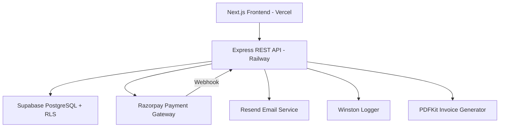

<h1 align="center">PhysioWaye</h1>

<p align="center">
  <strong>Physiotherapy Equipment E-Commerce Platform</strong><br/>
  A production-grade, full-stack e-commerce application with enterprise security, real payment processing, and clean architecture.
</p>

<p align="center">
  <a href="https://www.physiowaye.com" target="_blank">
    
  </a>
  
  
  
</p>

---

## Overview

PhysioWaye is a freelance, client-facing e-commerce platform built for a physiotherapy equipment business. It supports the complete customer journey — product discovery, cart and wishlist management, secure Razorpay checkout, order tracking, and account management — backed by a Node.js/Express REST API, a PostgreSQL database with Row Level Security, and an Admin Dashboard with sales analytics.

The project is built for long-term production use on a cost-minimal infrastructure stack with a custom domain, and follows clean architecture principles: Repository Pattern, layered service separation, centralized error handling, and structured logging.

---

## Tech Stack

| Layer | Technology |
|---|---|
| Frontend | Next.js, React.js, JavaScript, HTML5, CSS3 |
| Backend | Node.js, Express.js, REST APIs |
| Database | PostgreSQL via Supabase (Row Level Security) |
| Authentication | JWT + RBAC · Supabase Google OAuth · Email Login |
| Payments | Razorpay (Orders API + Webhook verification) |
| Email | Resend (transactional email) |
| PDF | PDFKit (invoice generation) |
| Validation | Zod |
| Logging | Winston (structured, leveled logging) |
| Security | Helmet.js · express-rate-limiter · bcrypt · input sanitization |
| Testing | Jest (unit tests — auth middleware + payment webhook) |
| CI/CD | GitHub Actions (ESLint + Jest on every push) |
| Hosting | Vercel (frontend) · Railway (backend) · Supabase (database) |
| Domain | [physiowaye.com](https://www.physiowaye.com) (custom domain) |

---

## Features

### 🛒 Customer
- Product catalog with category filtering, pagination, debounced search, and search suggestions
- Shopping cart with persistent state
- Wishlist and recently viewed products
- Product reviews and star ratings
- Address management (multiple addresses, default selection)
- Razorpay checkout with webhook-based order confirmation and product stock validation
- Coupon and discount code validation at checkout
- Order tracking across full lifecycle (placement → confirmation → shipping → delivery)
- Order cancellation workflow and return/refund request workflow
- PDF invoice download per order
- Email notifications (order confirmation, status changes)

### 🔐 Security & Authentication
- JWT authentication with 3-role RBAC: `customer`, `admin`, `super_admin`
- Supabase Google OAuth + email/password login with bcrypt password hashing
- PostgreSQL Row Level Security (RLS) on all user-specific tables
- Rate limiting on all API endpoints (express-rate-limiter)
- Helmet.js security headers and input sanitization
- Zod input validation on all request bodies
- Activity / Audit logging for all critical user and admin actions
- Centralized error handling middleware
- Environment variable management (`.env.example` provided)

### 👤 Admin
- Admin Dashboard with daily / weekly / monthly sales reports
- Product management: CRUD, image upload with Sharp compression, soft delete
- Order management: status updates across full order lifecycle
- Inventory, customer, and coupon management

### ⚙️ Engineering & DevOps
- Repository Pattern — database access fully decoupled from route/controller logic
- Layered architecture: routes → controllers → services → repositories
- API versioning (`/api/v1/`) for long-term maintainability
- Winston structured logging with log levels (info / warn / error), file output in production
- Health Check API (`GET /api/health`) — server status, DB connectivity, uptime
- Swagger/OpenAPI documentation — live interactive UI at `/api/docs`
- Soft delete pattern (`is_deleted` flag) across all major entities
- Database indexing strategy documented and applied on high-query columns
- Image compression via Sharp + `loading="lazy"` on frontend
- Paginated list endpoints with configurable `page` and `limit`
- Progressive Web App (PWA) — installable, offline page supported
- Unit tests (Jest) for JWT auth middleware and Razorpay webhook handler
- GitHub Actions CI/CD: ESLint + Jest gates on every push to `main`
- Database backup strategy via Supabase Point-in-Time Recovery (documented)
- System architecture diagram and API flow diagram (see `/docs`)

---

## Project Structure

```
physiowaye/
├── client/                        # Next.js frontend
│   ├── components/                # Reusable UI components
│   ├── pages/                     # Next.js routes
│   ├── public/                    # Static assets, PWA manifest
│   └── styles/
│
├── server/                        # Express.js backend
│   ├── controllers/               # Route handler logic
│   ├── middleware/                # Auth, error handler, rate limiter, validator
│   ├── repositories/              # Database access layer (Repository Pattern)
│   ├── routes/                    # Versioned API route definitions (/api/v1/)
│   ├── services/                  # Business logic: payment, email, PDF
│   ├── utils/                     # Winston logger, helpers
│   ├── tests/                     # Jest unit tests
│   └── server.js
│
├── docs/                          # Architecture diagram, API flow diagram, ER diagram
│
├── .github/
│   └── workflows/
│       └── ci.yml                 # GitHub Actions CI/CD pipeline
│
└── .env.example                   # Environment variable template
```

---

## System Architecture



---

## API Architecture

```
/api/v1
├── /auth          — register, login, OAuth
├── /products      — catalog, search, suggestions, reviews
├── /cart          — cart management
├── /wishlist      — wishlist management
├── /addresses     — saved addresses
├── /orders        — order lifecycle, cancellation, returns
├── /payments      — Razorpay order creation + webhook
├── /coupons       — coupon validation
├── /admin         — dashboard, product/order/customer management
└── /health        — health check
```

---

## API Reference

Live interactive docs: `https://your-backend-url/api/docs` (Swagger UI)

| Method | Endpoint | Auth | Description |
|--------|----------|------|-------------|
| POST | `/api/v1/auth/register` | — | Register customer |
| POST | `/api/v1/auth/login` | — | Login, returns JWT |
| GET | `/api/v1/products` | — | List products (paginated + searchable) |
| GET | `/api/v1/products/:id` | — | Single product detail |
| GET | `/api/v1/cart` | Customer | Get cart |
| POST | `/api/v1/cart` | Customer | Add to cart |
| GET | `/api/v1/wishlist` | Customer | Get wishlist |
| POST | `/api/v1/wishlist` | Customer | Add to wishlist |
| GET | `/api/v1/addresses` | Customer | List saved addresses |
| POST | `/api/v1/orders` | Customer | Place order (with stock validation) |
| GET | `/api/v1/orders/:id` | Customer | Order detail |
| POST | `/api/v1/orders/:id/cancel` | Customer | Cancel order |
| POST | `/api/v1/orders/:id/return` | Customer | Request return/refund |
| GET | `/api/v1/orders/:id/invoice` | Customer | Download PDF invoice |
| POST | `/api/v1/payment/create-order` | Customer | Create Razorpay order |
| POST | `/api/v1/payment/webhook` | Signed | Razorpay webhook handler |
| POST | `/api/v1/coupons/validate` | Customer | Validate coupon code |
| GET | `/api/v1/admin/dashboard` | Admin | Sales report + metrics |
| PATCH | `/api/v1/admin/orders/:id/status` | Admin | Update order status |
| GET | `/api/health` | — | Health check |

---

## Database Design

| Table | Description |
|---|---|
| `users` | Accounts — role: `customer`, `admin`, `super_admin` |
| `products` | Product catalog — `is_deleted` soft delete |
| `categories` | Product categories |
| `cart_items` | Per-user cart (RLS enforced) |
| `wishlist` | Per-user saved products (RLS enforced) |
| `addresses` | Multiple saved addresses per user |
| `orders` | Order records with status state machine |
| `order_items` | Line items per order |
| `payments` | Razorpay payment records linked to orders |
| `reviews` | Product reviews and star ratings |
| `coupons` | Discount codes with usage limits |
| `return_requests` | Return and refund workflow |
| `audit_logs` | Activity and audit trail for all critical actions |

All user-specific tables enforce **Row Level Security** — users can only read and write their own rows, enforced at the database level independently of application logic.

> See `/docs/er-diagram.png` for the full ER diagram.

---

## Environment Variables

Copy `.env.example` to `.env` and fill in your values. **Never commit `.env` to version control.**

```env
# Server
PORT=5000
NODE_ENV=development

# Supabase
SUPABASE_URL=
SUPABASE_ANON_KEY=
SUPABASE_SERVICE_ROLE_KEY=

# JWT
JWT_SECRET=
JWT_EXPIRES_IN=7d

# Razorpay
RAZORPAY_KEY_ID=
RAZORPAY_KEY_SECRET=
RAZORPAY_WEBHOOK_SECRET=

# Email (Resend)
RESEND_API_KEY=
FROM_EMAIL=orders@physiowaye.com

# Frontend URL (for CORS)
CLIENT_URL=http://localhost:3000
```

---

## Getting Started

### Prerequisites
- Node.js v18+
- npm
- Supabase account (free tier)
- Razorpay account (test mode is free)

### Installation

```bash
# Clone the repository
git clone https://github.com/ShambhaviSingh16/physiowaye.git
cd physiowaye

# Install backend dependencies
cd server && npm install

# Install frontend dependencies
cd ../client && npm install
```

### Running Locally

```bash
# Backend (from /server) — runs on http://localhost:5000
npm run dev

# Frontend (from /client) — runs on http://localhost:3000
npm run dev
```

---

## Deployment

| Service | Purpose | Cost |
|---|---|---|
| [Vercel](https://vercel.com) | Next.js frontend | Free |
| [Railway](https://railway.app) | Node.js/Express backend | ~$5/month |
| [Supabase](https://supabase.com) | PostgreSQL + auth | Free tier |
| [Resend](https://resend.com) | Transactional email | Free (3k/month) |
| Custom domain | physiowaye.com | Already purchased |

---

## Screenshots

| Page | Preview |
|---|---|
| Home |  |
| Product Catalog |  |
| Checkout |  |
| Admin Dashboard |  |

---

## Roadmap

- [x] Product catalog with search and category filtering
- [x] Cart management
- [x] Supabase OAuth authentication
- [ ] Repository Pattern architectural refactor
- [ ] JWT + RBAC (3 roles: customer, admin, super_admin)
- [ ] Rate limiting + security hardening (Helmet, bcrypt, Zod, sanitization)
- [ ] Centralized error handling + Winston logging
- [ ] Activity / Audit logging
- [ ] Environment variable management (.env.example)
- [ ] Health Check API
- [ ] API versioning (/api/v1/)
- [ ] Input validation (Zod)
- [ ] Razorpay payment integration with webhooks
- [ ] Product stock validation during checkout
- [ ] Order management system (full lifecycle)
- [ ] Order cancellation workflow
- [ ] Return & refund workflow
- [ ] Coupon & discount system
- [ ] Admin Dashboard with sales reports
- [ ] PDF invoice generation (PDFKit)
- [ ] Transactional email notifications (Resend)
- [ ] Wishlist
- [ ] Product reviews & ratings
- [ ] Address management
- [ ] Recently viewed products
- [ ] Search suggestions + debounced search
- [ ] Pagination on all list endpoints
- [ ] Swagger/OpenAPI documentation (30+ endpoints)
- [ ] Image compression (Sharp) + lazy loading
- [ ] Soft delete + DB backup strategy documentation
- [ ] Database indexing strategy
- [ ] PWA (Progressive Web App)
- [ ] Unit tests — Jest (auth middleware + payment webhook)
- [ ] CI/CD pipeline — GitHub Actions (ESLint + Jest)
- [ ] System architecture diagram + API flow diagram

---

## Author

**Shambhavi Singh** — Software Engineer  
📧 Sshambhavi89@gmail.com &nbsp;|&nbsp;
🔗 [LinkedIn](https://linkedin.com/in/shambhavi-singh) &nbsp;|&nbsp;
🐙 [GitHub](https://github.com/ShambhaviSingh16) &nbsp;|&nbsp;
🌐 [Portfolio](https://your-portfolio-url)

---

<p align="center">If this project structure or implementation helped you, consider giving it a ⭐</p>
